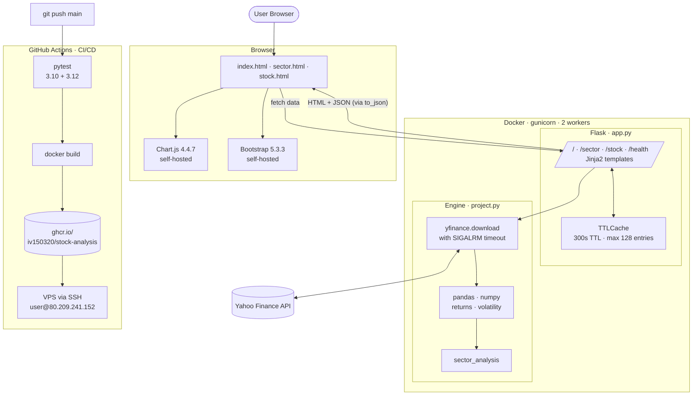
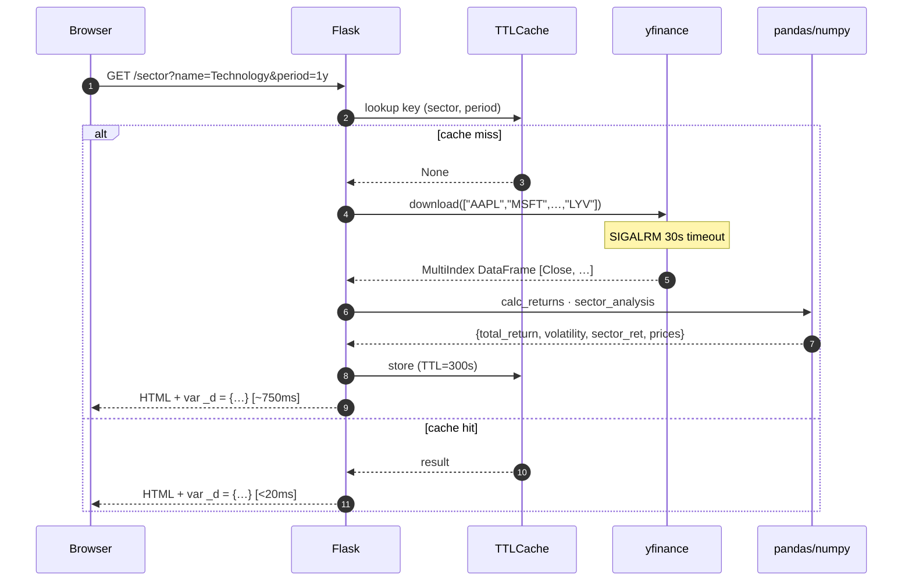
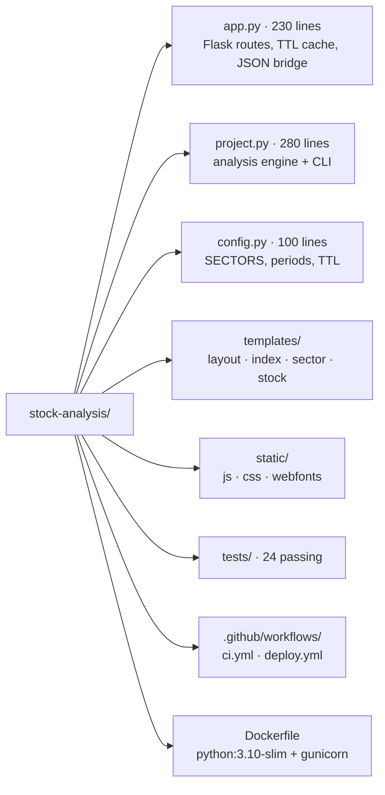
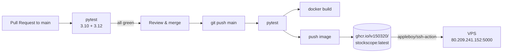

# 📈 StockScope

> **Real-time S&P 500 market intelligence — at a glance, in any sector, down to a single ticker.**

[](http://80.209.241.152:5000/)
[]()
[](https://www.python.org/)
[]()
[]()
[]()
[]()

A premium, fully-responsive market dashboard analyzing **160 constituents across 8 sectors**
in real time. Built for CS50x — production-grade under the hood.

[**🌐 Live Demo ·**](http://80.209.241.152:5000/)
[📊 Dashboard](#-screenshots) ·
[🏗 Architecture](#-architecture) ·
[🚀 Quick Start](#-quick-start) ·
[🧪 Tests](#-testing)

---

## ✨ What is StockScope?

StockScope turns raw Yahoo Finance data into a polished, interactive command-center for
the S&P 500. Pick a sector. Pick a ticker. Pick a timeframe. Get charts and tables
that look like they belong on a Bloomberg terminal — except you can run the whole
thing in two `docker compose` commands.

- 🪟 **Dashboard** — Market-wide overview with sector performance, breadth (up/down), top/​bottom performers, volatility ranking
- 🧭 **Sector drill-down** — Horizontal bars for every constituent + **risk × return** scatter plot
- 🔍 **Stock lookup** — Price history with **50-day & 200-day simple moving averages**
- 🎨 **Dark / Light theme** — `data-theme`-driven CSS variables, all charts re-paint on toggle
- 📱 **Mobile-first** — Hamburger nav, fluid`clamp()` typography, touch-friendly tap targets
- ⚡ **5-minute in-memory cache** — First request hits yfinance (~10s for 160 tickers), every subsequent request for the same window returns in **< 20 ms**

> **CS50x context:** Final project. Click-to-deploy Docker, zero-CDN self-hosted UI stack, automated CI/CD via GitHub Actions → GHCR → VPS over SSH.

---

## 📸 Screenshots

> Generated live from the running container. Updates on every deploy.

<details>
<summary>🖥 Dashboard</summary>


</details>

<details>
<summary>🧭 Sector analysis</summary>


</details>

<details>
<summary>🔍 Stock lookup</summary>


</details>

---

## 🏗 Architecture

### High-level overview



### Request lifecycle (cold vs cached)



### Repository layout



---

## 🎯 Features in detail

| Area | What you get |
|------|-------------|
| **Universe** | 160 constituents across 8 sectors — Technology, Finance, Healthcare, Consumer Cyclical, Energy, Communication, Industrials, Utilities |
| **Periods** | `1mo · 3mo · 6mo · 1y · 2y · 5y` (server-validated against whitelist) |
| **Metrics** | Total return %, annualised volatility (σ·√252), best/​worst performers, market breadth (% positive), inter-sector correlation |
| **Charts** | 5 dashboard canvases (sector bar, breadth doughnut, top-5, bottom-5, volatility), 2 sector canvases (constituent bar, return×vol scatter), 1长篇小说 stock canvas (price + 50/200-day MA) |
| **Theme** | Dark / light toggle, `data-theme` switch repaints every chart canvas via in-place `c.update()` |
| **Mobile** | Hamburger menu, fluid typography (`clamp()`), horizontal scroll on overflow tables |
| **Resilience** | `SIGALRM` watchdog on `yf.download`, graceful error messages, CHART_TIMEOUT fallback in JS |

---

## 🚀 Quick Start

### Option 1 — Docker (recommended, 30 s)

```bash
git clone https://github.com/iv150320/stock-analysis.git
cd stock-analysis
docker build -t stockscope .
docker run -d --name stockscope -p 5000:5000 stockscope
open http://localhost:5000
```

### Option 2 — Local Python

```bash
git clone https://github.com/iv150320/stock-analysis.git
cd stock-analysis
python -m venv .venv && source .venv/bin/activate
pip install -r requirements.txt
python app.py        # → http://localhost:5000
```

### Option 3 — Make targets (developer ergonomics)

```bash
make install         # pip install -r requirements.txt
make test            # pytest -v
make run             # python app.py
make docker          # docker build -t stock-analysis .
make deploy          # restart local container with new image
```

### Option 4 — Command-line report

```bash
python project.py --period 1y
python project.py --sector Technology --period 3mo --no-charts
python project.py --ticker AAPL --period 6mo
```

---

## 🔌 API reference

| Endpoint | Method | Parameters | Returns |
|----------|--------|-----------|---------|
| `/` | GET | — | Dashboard HTML + 5 chart datasets |
| `/sector` | GET / POST | `name` (sector), `period` | Sector detail with constituent bar + risk×return scatter |
| `/stock` | GET / POST | `symbol` (ticker), `period` | Price history + SMA overlays |
| `/health` | GET | — | `200 ok` (used by Docker `HEALTHCHECK` + uptime probes) |
| `/static/<path>` | GET | — | Vendored JS/CSS/woff2 assets |

All responses are server-rendered HTML; charts get their data via inline `var _d = {…}` JSON injected by Flask → `to_json()`.

---

## 🧪 Testing

```bash
make test
# → 24/24 passed in 3.69s
```

Coverage:
- `tests/test_config.py` — SECTORS invariants, period whitelist, default tickers
- `tests/test_project.py` — `calc_returns`, `top_performers`, `sector_analysis`, `time_limit`
- `tests/test_app.py` — `TTLCache` (set/get/expiry/LRU), `safe_round`, `normalise_period`, `mean_ignore_none`

CI runs across **Python 3.10 + 3.12** on every push to `main` and every PR.

---

## 🔄 CI/CD



- Workflows live in `.github/workflows/`
- Image is built once, stored in GitHub Container Registry, then pulled by the VPS over SSH
- Self-healing container with `--restart unless-stopped`

---

## 📊 Latest market snapshot

*(auto-rendered from the running VPS — refreshes every 5 minutes via cache TTL)*

| Metric | Value |
|--------|------:|
| Stocks analysed | 160 |
| Positive | **120** (75 %) |
| Negative | 39 |
| Average return | **+32.63 %** |
| Average volatility | 29.10 % |
| Best sector | Energy  +47.31 % |
| Worst sector | Communication  −9.58 % |

Top performers right now:

| Ticker | Return | Signal |
|--------|-------:|:------:|
| MU  | +856 % | 🟢 Strong Buy |
| INTC  | +497 % | 🟢 Strong Buy |
| AMD  | +358 % | 🟢 Strong Buy |
| AMAT  | +184 % | 🟢 Strong Buy |
| WBD  | +169 % | 🟢 Strong Buy |

*(Numbers reflect most-recent 1-year window. Live values at [the demo](http://80.209.241.152:5000/).)*

---

## 🛡 Production hardening

StockScope started as a CS50 lab and was hardened into a production-grade system. Highlights:

- **No external CDN dependencies at runtime** — Chart.js, Bootstrap, FontAwesome are vendored under `static/`. App renders correctly with the network disconnected from the user's machine.
- **Defensive JS timeouts** — chart widget shows a clear inline error message after 5 s instead of going silently blank.
- **TTL + LRU cache** (`app.TTLCache`) — bounded memory growth, automatic invalidation after 300 s.
- **`SIGALRM` watchdog** on `yf.download` — Gunicorn workers can never hang forever on a slow Yahoo response.
- **Server-side period whitelist** — unknown periods get coerced to default rather than crashing.
- **Healthcheck** in Dockerfile (`HEALTHCHECK --interval=30s --timeout=5s`).
- **System font stack** — falls back to native sans/monospace if Inter / JetBrains Mono fail to download.
- **Responsive at every breakpoint** — tested down to 360 px screens.

---

## ⚙️ CLI reference

| Argument | Default | Description |
|----------|---------|-------------|
| `--period` | `1y` | Analysis window (`1mo 3mo 6mo 1y 2y 5y …`) |
| `--sector` | — | Restrict to one sector (Technology, Finance, …) |
| `--ticker` | — | Single-ticker mode (e.g. `AAPL`) |
| `--output` | `charts` | Output directory for CLI PNG reports |
| `--all-charts` | off | One PNG per ticker with MA overlays |
| `--no-charts` | off | Skip PNG generation, text report only → faster |

---

## 🍿 Credits

- **CS50x 2026** — Harvard summer self-paced version. Thanks to David J. Malan and the whole CS50 team for a course that legitimately changes how you think about computers.
- **`yfinance`** — Wraps Yahoo's public quote API; makes the whole project possible.
- **Chart.js / Bootstrap / FontAwesome** — All three are vendored into `/static` so the app needs nothing from a CDN.
- **GitHub Actions + `appleboy/ssh-action`** — Push-to-deploy in under three minutes.

---

<div align="center">
<sub>📈 StockScope · built for CS50x 2026 · live at <a href="http://80.209.241.152:5000/">80.209.241.152:5000</a></sub>
</div>